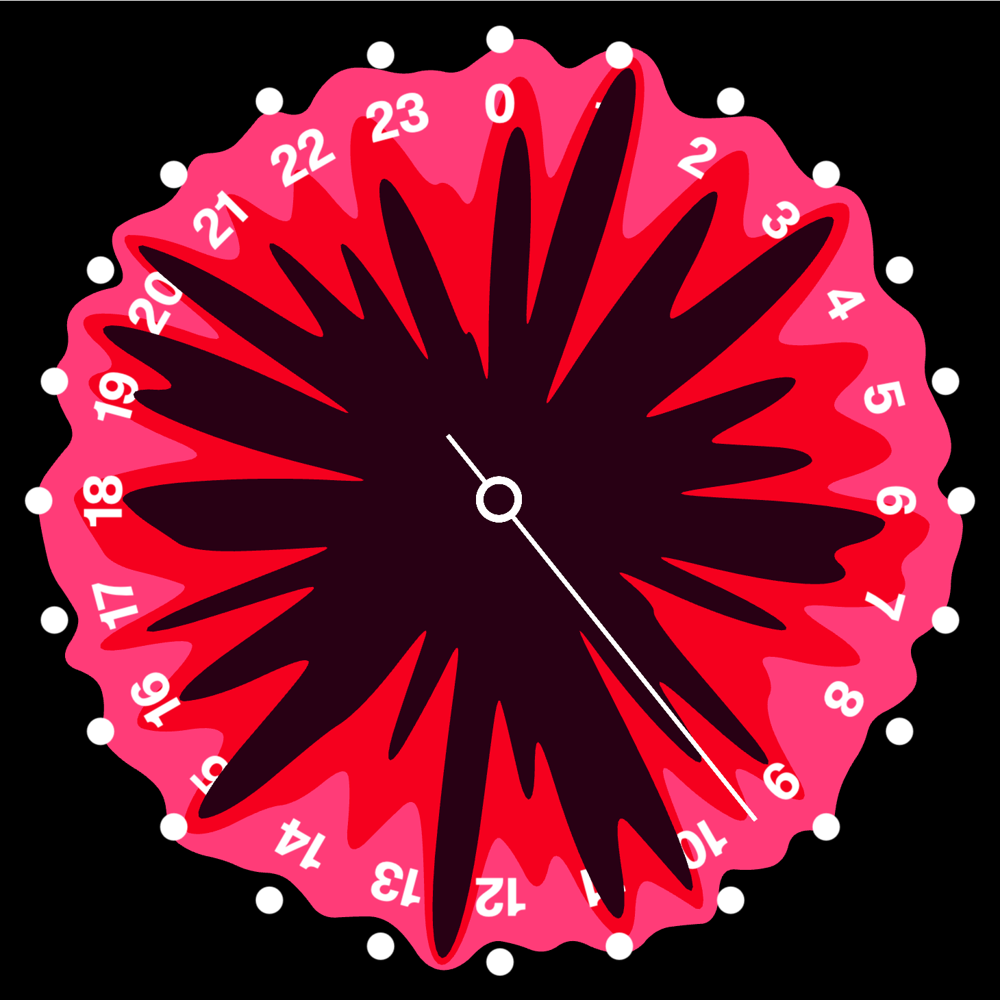

# Clock Visualization Library

A TypeScript library for creating customizable, animated clock visualizations using PIXI.js.

<div align="center">
  
</div>

## Getting Started

### Prerequisites

1. Install Visual Studio Code
   - Download VS Code from [code.visualstudio.com](https://code.visualstudio.com)
   - Follow the installation instructions for your operating system
   - Optional: Install helpful extensions like "Live Server" and "TypeScript"

### Quick Start with Examples

1. Browse the examples at [https://ptrrr.github.io/energy-clock-lib/examples/](https://ptrrr.github.io/energy-clock-lib/examples/)
2. Find an example you like and click its "demo" link to view the source code on GitHub
3. Open the example in VS Code:

   - Copy the code from GitHub
   - Create a new file in VS Code (e.g., `clock-example.html`)
   - Paste the code and save
   - If you installed Live Server:
     - Right-click the file
     - Select "Open with Live Server"
   - Without Live Server:
     - Double-click the file to open in your browser

4. Start experimenting!

   - Modify the code to see instant changes
   - Try changing colors, sizes, or adding new elements

5. Try Autopilot Mode

   - Create a new HTML file with this basic structure:

     ```html
     <html lang="en">
       <head>
         <meta charset="UTF-8" />
         <meta
           name="viewport"
           content="width=device-width, initial-scale=1.0"
         />
         <title>Document</title>
         <script src="https://clocks-lib.vpr-group.ch/api/autopilot"></script>
       </head>
       <body>
         <script nomodule autopilot>
           // 1. Create clock with the imported helper function
           // 2. Add six radial charts with different shades of pink and with noise value remapped from half of the clock radius and to the clock radius - 40.
           // 3. Create a stacking effect by reducing the remap values for each chart in order for them to become smaller and smaller
           // 4. Each step should be of size clock radius - (clock radius / six * step index)
           // 5. Each one of the chart should be unique but use the same noise values (but remapped as explained in step 3 to create a stacking effect)

           clock.addTexts({
             count: 24, // Label for each hour/position
             fontSize: 40, // Size of text
             offset: 20, // Distance from edge
           });

           // 6. For each number add a corresponding long rectangle beneath it. the rectangles and the numbers should not overlapp
         </script>
       </body>
     </html>
     ```

   - The autopilot will:
     - Complete partial code snippets
     - Generate code for natural language instructions
     - Combine and connect different components
     - Fix syntax errors automatically
     - Add necessary imports and configurations
   - You can gradually replace autopilot-generated code with your own as you learn

## Workshop Origins

This framework was developed as a teaching tool for a graphic design workshop introducing students to computer graphics and data-driven design principles. It provides an approachable entry point to WebGL, shader programming, and generative design through the familiar metaphor of clock visualization. The library abstracts complex graphics programming concepts while still allowing students to experiment with advanced features as their understanding grows.

## Examples

[Browse Examples](https://ptrrr.github.io/energy-clock-lib/examples/)

## Features

- SVG-based clock face and hand rendering
- Customizable radial charts and indices
- Support for various shapes (circles, rectangles, triangles, text)
- Custom shader support
- Texture mapping
- Smooth animations
- Blend mode support
- High-performance WebGL rendering

## Installation

```bash
npm install clock-visualization
```

## Basic Usage

```typescript
import { Clock } from "clock-visualization";

// Create clock instance
const clock = new Clock(container);
await clock.initialize();

// Add clock hands
clock.addHandle({
  imageUrl: "/assets/hand.svg",
  label: "hours",
});

// Add hour markers
clock.addCircles({
  count: 12,
  radius: 2,
  fill: "white",
});

// Add animation
clock.addAnimation(defaultClockStep(clock));
```

## Advanced Features

- Custom shader support for advanced visual effects
- Radial charts for data visualization
- Custom shape handlers
- Noise-based value generation
- Font loading and rendering
- SVG conversion utilities

## License

MIT
